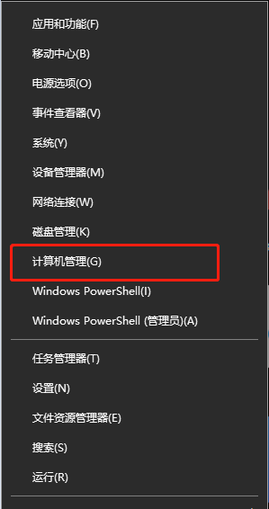
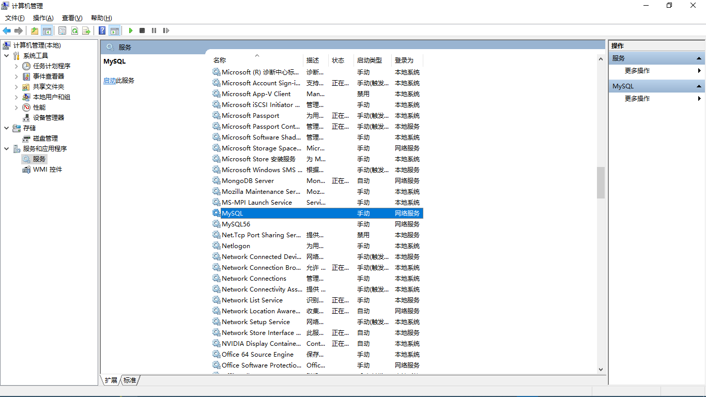
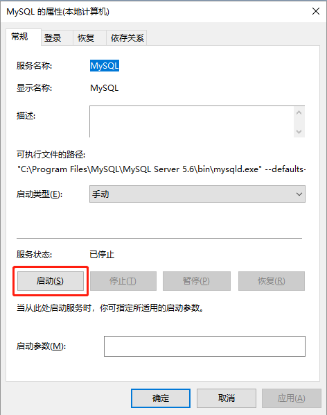
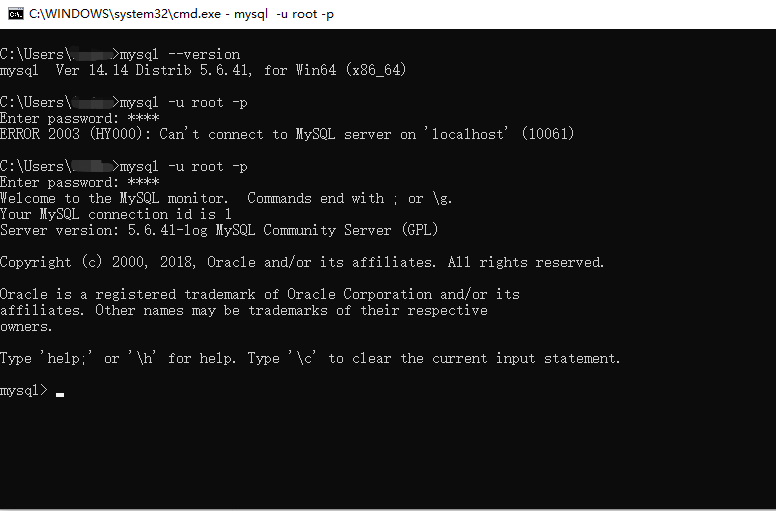

- 在命令输入MySQL登陆命令，出现下图情况：

    .jpg)

- 方法一：

    - 按 windows+x 或者在电脑屏幕左下角右键，出现下图：

        

    - 进去计算机管理界面，如下图所示：

        

    - 双击图中的MySQL选项，进入图中的MySQL属性界面，如下图所示：

        

    - 单击启动即可
    
    - 完成上述操作后，再次登陆MySQL，如下界面所示：
    
        

- 方法二：

    - 如果在计算机管理界面中找不到MySQL服务，则需要手动安装MySQL服务，安装命令为：

        ```cmd
        mysqld -install
        ```

    - 在cmd中启动MySQL服务即可

        ```cmd
        net start mysql
        ```

[more in detail](https://jingyan.baidu.com/article/a681b0de5ac1dc3b1943467d.html)

[more in detail](https://blog.csdn.net/chen97_08/article/details/81484286)

